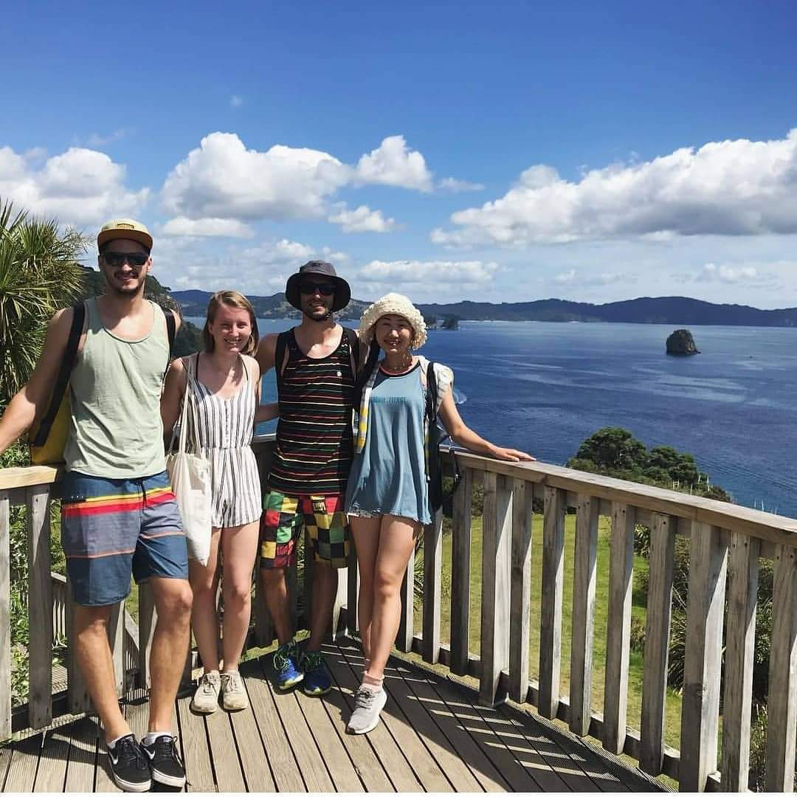
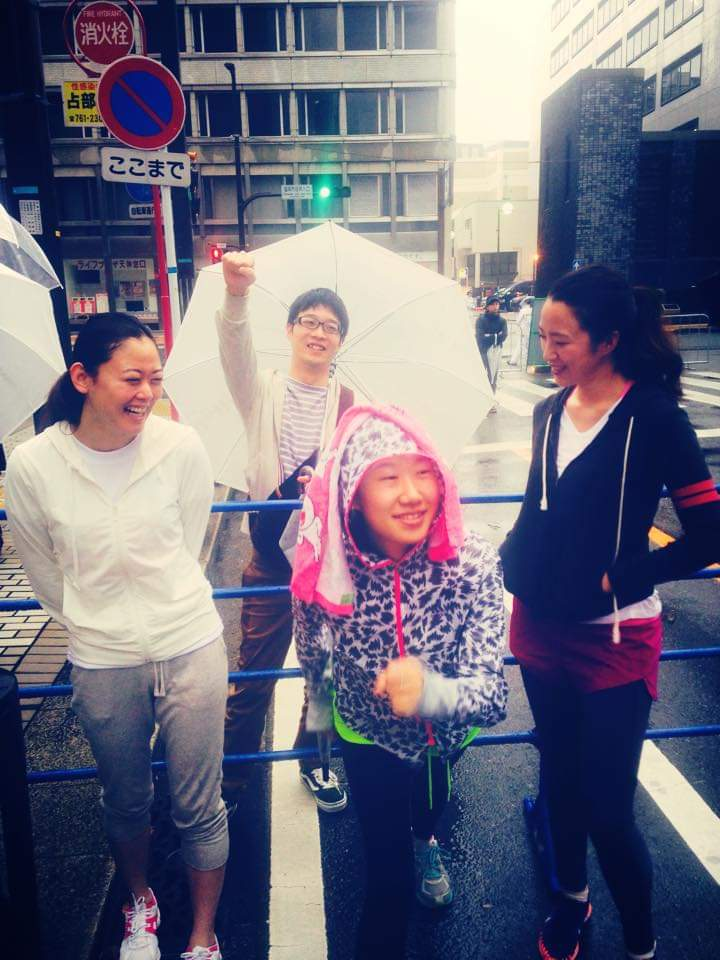

# 김은영 Eunyoung Emily Kim 

**Full-stack developer from Seoul, South Korea. Fluent in Korean , Japanese , and English .**
 반갑습니다. 서른 넘어 개발을 시작한 용감한 개발자, 김은영입니다!
 단단하고 유연하게, 늘 성장하겠습니다 :)

### 🛠️ My tech stack...
>  
> 
> 
> 
> 
> 
> 
> 
> 
> 
>  
> 
> 
> 
> 
> 
> 
> 
> 
> 
> 
> 

### 💭 About me?

> > 
  
> >  
 👉 <u>한국어로 읽기 & <b>Pictures Here!</b></u> 👈 
 <ul>
> >    <li> 전 직장은 🏢<strong>네이버 비서로, 수많은 개발자와 기획자 그리고 리더님들 가까이</strong>👩‍💻에서 그들의 원활한 업무를 도왔습니다. 그 때의 경험이 개발자로의 전향에 큰 영향을 주었습니다.</li>
> >    <li> 사회 경력은 <strong>한국 5년, 뉴질랜드 1년, 일본 2년</strong>, 다양한 나라와 직장에서 일했습니다. 도합 <strong>13년 거주한 🗾일본어</strong>는 저의 <strong>제2모국어✌️</strong>입니다.</li>
> >    <li> 코로나 19 시기에 퇴사 후, 지인들과 🎨<strong>그림 전시회 (2021)</strong> 및 📷<strong>사진 전시회 (2023)</strong>를 기획해 참가했습니다. 💐<strong>제 작품은 모두 판매</strong>💰되어 소소하나마 빅이슈, 노약자 지원 💵<strong>NGO에 기부</strong>✨하였습니다.</li>
> >    <li> 제가 즐겨하는 운동은 🧘‍♀️<strong>요가</strong>, 🏃‍♀️<strong>런닝</strong>, 그리고 🏄<strong>서핑</strong> 입니다. 언젠가 하와이 호놀룰루 풀 마라톤을 뛰는 것이 꿈입니다!</li>
> >    <li> 저는 <strong>사교를 좋아하고</strong>🤝 언제 어디서나 <strong>누구와도 편하게 대화하는 편</strong>🤗입니다. <strong>작고 우연한 인연도 소중히</strong> 대하는 것이 삶의 모토입니다💗</li> </ul>
> >
> >  

> >    
> >    
> >    
> >    
> >  

> > 

>
> - I worked as an **assistant at NAVER**👩‍💻, the well-known Korean IT company famous for LINE messenger. There, I had an opportunity to **interact with hundreds of developers and project planners or managers**, which inspired me to pursue a new career!
> - Before that, I worked in **New Zealand🥝, Korea**, and **Japan**🌸 for **several years** each. In fact, I've lived in **Japan🗾 for 13 years** so Japanese is like a second mother tongue to me.
> - During and after the pandemic, I organized and participated in a 🎨**painting exhibition (2021)** and a 📷**photo exhibition (2023)**. All of my artworks were 💵**sold and I donated**✨ the proceeds to BigIssue, a Korean NGO for homeless people.
> - I do 🧘‍♀️**yoga**, 🏃‍♀️**run**, and sometimes 🏄**surf** as hobbies. Running a full marathon in Honolulu is on my bucket list!
> - I love **socializing**🤝 and always **easily build rapport**🤗 whenever I meet someone new. If you want to be one of my friends, say hi via the links below!🙋

### 📫 Contact me!

>   <a href="https://blog.naver.com/bunn_ey_run_ey">  https://blog.naver.com/bunn_ey_run_ey</a>  
>   eunyoung-kim@naver.com

### 📚 I'm working on...

> - Every-day Algorithm Study  <a href="https://github.com/EyEmilyKim/BOJ">🔗</a>
> - My Spring Boot Project "My Account Book 3": Deployed & Maintanance <a href="https://github.com/EyEmilyKim/MyPrj_MyAccountBook3_springBoot">🔗</a>
> - My React Project "My Chatting App": Developing (90%) <a href="https://github.com/EyEmilyKim/MyPrj_MyChat-Retry">🔗</a>  
>   and more ...    
>   📌   
>   
